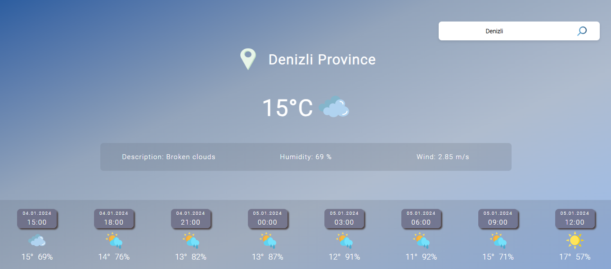

<h1> 🌦 Weather-App</h1>
## Bu uygulamada weather api kullanarak  Weather-App uygulamasını oluşturdum.

## 🔴Projenin deploy edilmiş versiyonu :
 <h3><a href="https://weather-app-betul.netlify.app/">Mapty-App</a></h3>
 
### Uygulama hakkında:
* Uygulamayı açtığınızda sizden konumunuza erişim izni isteyecek ve izin verildiği takdirde konumunuza ait hava durumu bilgileri gösterilecek.
* O an ki konumunuz dışında istediğiniz konum ismini yazarak hava durumu verilerine erişebilirsiniz.
* Üst kısımda bugüne ait hava durumu bilgileri; alt kısımda ise bugünün saatinden itibaren 3'er saat arayla güncellenen hava durumu bilgileri yer alacak.
 

## ✨Projenin görselleri :

### - 🛠 Kullandığım teknolojiler :

 
 

